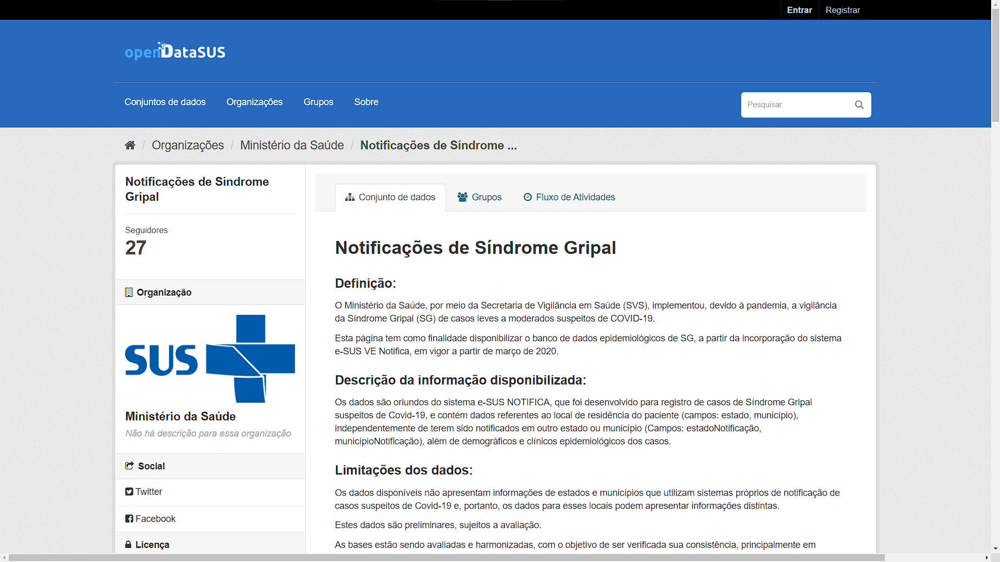
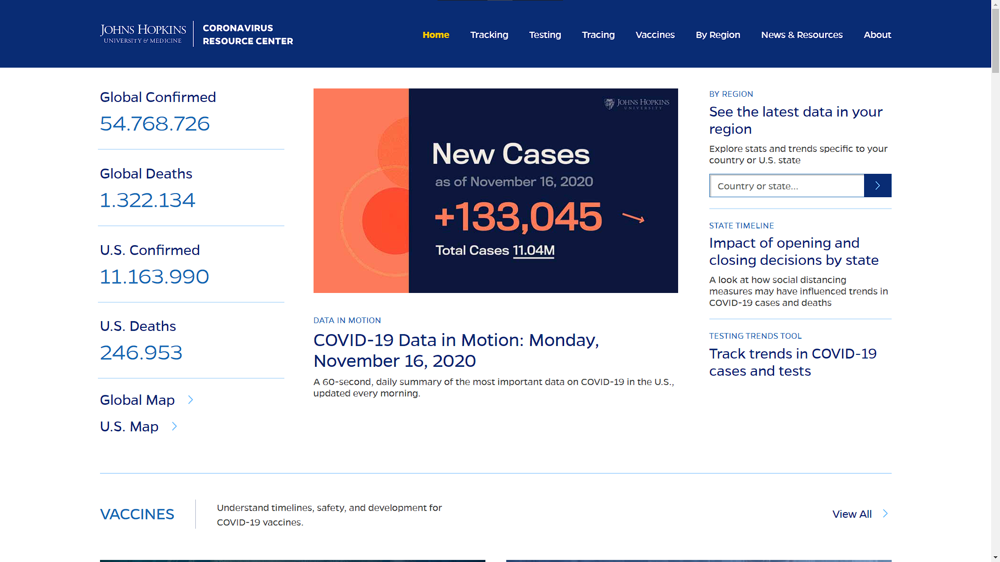
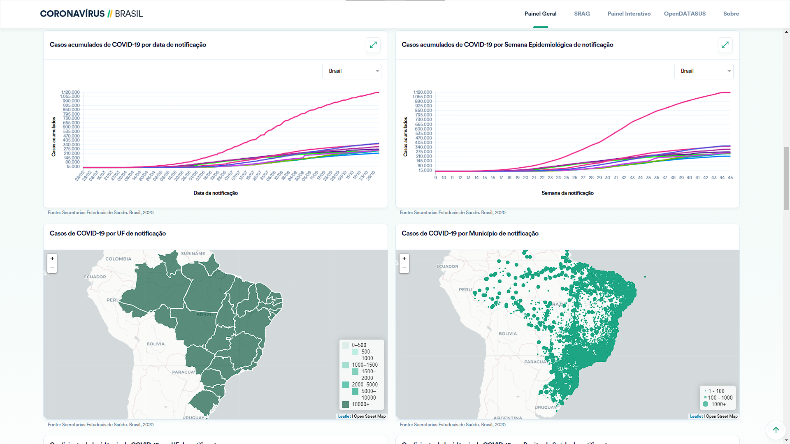
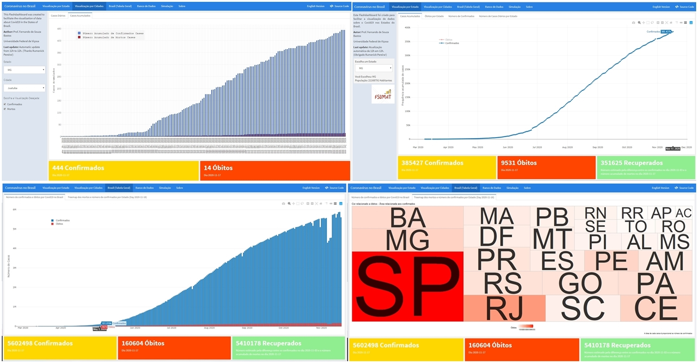
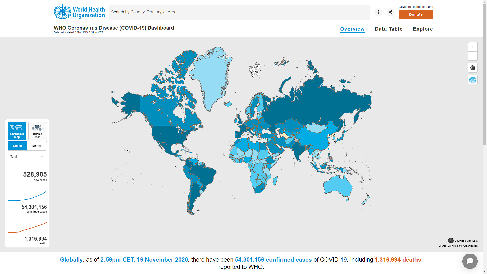
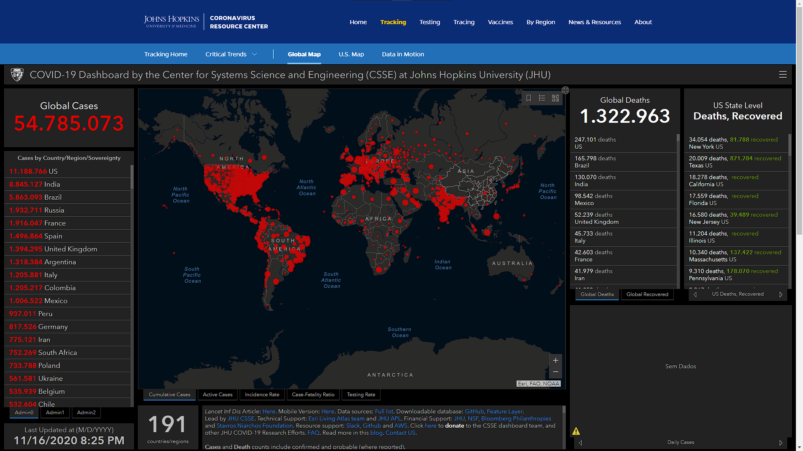
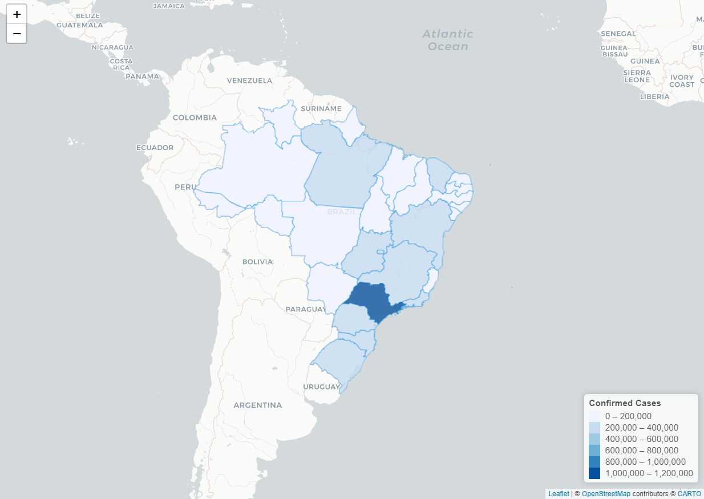
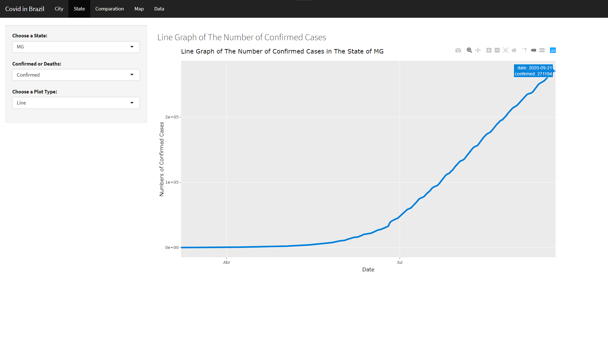

```{r, include=FALSE}
xaringanExtra::use_webcam ()
```
```{r, include=FALSE}
library(tidyverse)
library(knitr)
library(emo)
library(data.table)
```
```{r xaringan-panelset, echo=FALSE}
xaringanExtra::use_panelset()
```
```{r, include=FALSE}
df <- fread("data/caso.csv",
            encoding = "UTF-8")

dfCity <- df %>%
          filter(place_type == "city") %>% 
          arrange(city)


dfState <- df %>%
          filter(place_type == "state") %>% 
          arrange(state)

dfStateLast <- dfState %>% 
  filter(is_last == TRUE)
```

class: center, middle

```{r qrcode, echo=FALSE, out.width='30%'}

```
</div>
.center[
[guilhermefco.github.io/semat2020](guilhermefco.github.io/semat2020)
]

---
### Orientação

.center[
Professor Doutor Fernando de Souza Bastos
]
.center[
```{r fernando, echo=FALSE, out.width='25%'}
knitr::include_graphics('img/fernando.gif')
```
]
.center[
<a href="https://www.linkedin.com/in/fsbmat/"><i class="fab fa-linkedin" style="font-size:40px;"></i></a>
<a href="https://github.com/fsbmat-ufv"><i class="fab fa-github" style="font-size:40px;"></i></a>
<a href="https://fsbmat-ufv.github.io/"><i class="fas fa-globe" style="font-size:40px;"></i></a>
]

### Apoio

.center[
```{r cnpq, echo=FALSE, out.width='50%'}
knitr::include_graphics('img/pibic_cnpq.jpg')
```
]

---
# Covid-19 (SARS-CoV-2)

.center[
```{r sarsCoV2, echo=FALSE, out.width='60%'}
knitr::include_graphics('img/sarsCoV2.jpg')
```
]

**Fonte:** [Journal of Medical Virology](https://onlinelibrary.wiley.com/doi/full/10.1002/jmv.25685)

---
# Covid-19 (SARS-CoV-2)

<h3>Sintomas</h3>

- Febre
  
- Tosse seca
  
- Cansaço

- Dificuldade de respirar
  
- Outros sintomas menos comuns:
  
  * Perda de paladar ou olfato
    
  * Dor de cabeça
    
  * Dor de garganta

**Fonte:** [OMS](https://www.who.int/emergencies/diseases/novel-coronavirus-2019/advice-for-public)

---
# Covid-19 (SARS-CoV-2)

<h3>Transmissão</h3>


- .justify[
A transmissão ocorre pelo ar, ou por contato pessoal, através de secreções contaminadas.
]
 
- .justify[
Devido ao modo de transmissão vários lugares do mundo decretaram isolamento social visto que até o momento não há medicamento para o combate e enfrentamento da doença.
]
  
**Fonte:** [OMS](https://www.who.int/news-room/q-a-detail/coronavirus-disease-covid-19-how-is-it-transmitted#:~:text=COVID%2D19%20is%20caused%20by,speak%2C%20sing%20or%20breathe%20heavily.)

---
# Banco de Dados

.panelset[
  .panel[.panel-name[Governo Federal]
.center[
```{r govCovid, echo=FALSE, out.width='75%'}

```
]  

**Fonte:** [Governo Federal do Brasil](https://opendatasus.saude.gov.br/dataset/casos-nacionais)
  ]
  
  .panel[.panel-name[Brasil.io]
.center[
```{r Brasil.io, echo=FALSE, out.width='75%'}
knitr::include_graphics('img/brasil.io.png')
```
]  

**Fonte:** [Brasil.io](https://brasil.io/home/)
  ]
  
  .panel[.panel-name[Jhon Hopkins]
.center[
```{r jhData, echo=FALSE, out.width='75%'}

```
]    
  
**Fonte:** [Jhon Hopkins University](https://github.com/CSSEGISandData/COVID-19)
  ]
]

---
# Dashboards

.panelset[
  .panel[.panel-name[Governo Federal]
.center[
```{r govDashboard, echo=FALSE, out.width='75%'}

```
]
  
**Fonte:** [Governo Federal do Brasil](https://covid.saude.gov.br/)
  ]
  .panel[.panel-name[CoronaBR]
.center[
```{r CoronaBR, echo=FALSE, out.width='75%'}

```
]

**Fonte:** [CoronaBR](https://github.com/fsbmat-ufv/CoronaBR)
  ]
  .panel[.panel-name[OMS]
.center[
```{r omsDashboard, echo=FALSE, out.width='75%'}

```
] 

**Fonte:** [OMS](https://covid19.who.int/)
  ]
  .panel[.panel-name[Jhon Hopkins]
.center[
```{r jhDashboard, echo=FALSE, out.width='75%'}

```
]
  
**Fonte:** [Jhon Hopkins University](https://coronavirus.jhu.edu/map.html)
  ]
]

---
class: middle, center, inverse

# Objetivos

---
# Gráficos

.panelset[
  .panel[.panel-name[1]
.center[
```{r, echo=FALSE, fig.width= 7, fig.height= 5, fig.retina=3}
dfState %>%
  filter(state == "MG") %>%
  ggplot(aes(x = date,
             y = confirmed)
  ) +
  geom_line(color = "#0786db", lwd = 1.2) +
  xlab("Data") +
  ylab("Número de Casos Confirmados") +
  ggtitle('Gráfico de linhas do número de casos confirmados no estado de Minas Gerais')
```
]
  ]
  .panel[.panel-name[2]
  .center[
```{r, echo=FALSE, fig.width= 7, fig.height= 5, fig.retina=3}
dfState %>%
  filter(state == "MG") %>%
  ggplot(aes(x = date,
             y = deaths)
  ) +
  geom_line(color = "#0786db", lwd = 1.2) +
  xlab("Data") +
  ylab("Número de Óbitos") +
  ggtitle('Gráfico de linhas do número de óbitos no estado de Minas Gerais')
```
]
  ]
  .panel[.panel-name[3]
.center[
```{r, echo=FALSE, fig.width=7, fig.height= 5, fig.retina=3}
dfState %>% 
  filter(is_last == TRUE) %>%
  top_n(n = 10, confirmed) %>% 
  ggplot(aes(x = reorder(state, -confirmed), 
             y = confirmed)) +
  geom_col(fill = "#0786db", color = "black") +
  xlab("Estado") +
  ylab("Número de Casos Confirmados") +
  ggtitle('Gráfico de barras comparando os 10 maiores números de casos\n confirmados por Estado no Brasil')
```
]
  ]
  .panel[.panel-name[4]
.center[
```{r map, echo=FALSE, out.width='75%'}

```
]
  ]
]

---
# Shiny

.center[
``` {r shiny, echo=FALSE, out.width='80%'}

```
]

Você pode acessar [clicando aqui.](https://guilhermefco.shinyapps.io/CovidInBrazil/)

---
# Modelo TCC

.panelset[
  .panel[.panel-name[Site]
.center[
``` {r Site2, echo=FALSE, out.width='75%'}
knitr::include_graphics('img/SiteTCC.png')
```
]
  ]
  .panel[.panel-name[PDF]
.center[
``` {r pdf, echo=FALSE, out.width='70%'}
knitr::include_graphics('img/pdf.jpg')
```
]
  ]
]

Será lançado em breve. `r emo::ji("smile")`

---
class: center, middle

# Agradecimentos

---
# Redes Sociais

.center[
Guilherme Fernandes Castro de Oliveira
]
.center[
``` {r eu, echo=FALSE, out.width='35%'}
knitr::include_graphics('img/eu.jpeg')
```
]
.center[
<a href="https://www.linkedin.com/in/guifernandesco/"><i class="fab fa-linkedin" style="font-size:40px;"></i></a>
<a href="https://github.com/GuilhermeFCO"><i class="fab fa-github" style="font-size:40px;"></i></a>
<a href="https://www.facebook.com/guifernandesco"><i class="fab fa-facebook" style="font-size:40px;"></i></a>
<a href="https://www.instagram.com/guifernandesco/"><i class="fab fa-instagram" style="font-size:40px;"></i></a>
<a href="https://twitter.com/guifernandesco"><i class="fab fa-twitter" style="font-size:40px;"></i></a>
<a href="mailto:guilherme.f.castro@ufv.br"><i class="far fa-envelope" style="font-size:40px;"></i></i></a>
]
.center[
**E-mail:** <a href="mailto:guilherme.f.castro@ufv.br">guilherme.f.castro@ufv.br</a>
]

---
class: center, middle, inverse

# Obrigado!
